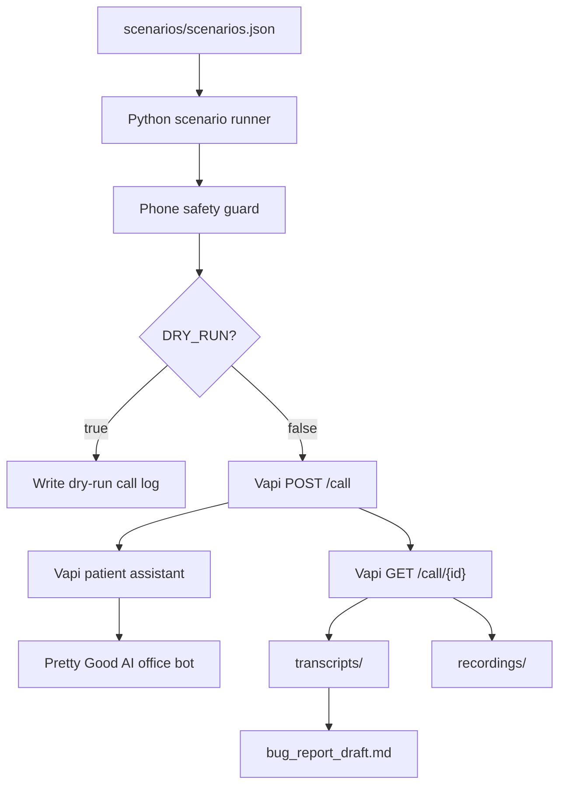

# Architecture

This project is a scenario runner and evidence collector for evaluating Pretty Good AI's office bot through realistic patient phone calls. Vapi owns the realtime voice layer: outbound calling, STT, TTS, interruption handling, recording, and transcript generation. Python owns the experiment: scenario loading, strict destination-number safety, Vapi API calls, result polling, local evidence storage, and bug-report drafting.

Python is used for orchestration because the challenge is mostly about controlled experiments and traceable artifacts rather than realtime audio infrastructure. The code can run locally, works in dry-run mode by default, and keeps all outputs in simple folders that are easy to review and submit.

## Vapi Boundary

Vapi is used for telephony, voice quality, turn-taking, transcripts, and recording URLs. This project does not need FastAPI, ngrok, Kubernetes, a database, a dashboard, or a custom WebSocket audio bridge. The tradeoff is that Vapi gives less low-level audio control than a custom telephony stack, but it keeps the project simpler and cheaper to run.

## Scenario-Driven Design

Each scenario in `scenarios/scenarios.json` defines patient details, the call goal, the opening message, constraints, success criteria, and bug-hunting focus. The runner converts these fields into Vapi dynamic variables under `assistantOverrides.variableValues`, so one assistant prompt can drive many patient behaviors.

## Safety

Outbound calls are blocked unless the destination normalizes exactly to `+18054398008`. The default `DRY_RUN=true` mode builds and logs the Vapi payload but never sends an API request. Real calls require valid Vapi credentials and `DRY_RUN=false`.

## Evidence Flow

After a live call, the runner polls Vapi for call details, writes a plain-text transcript, stores any structured transcript object, stores recording metadata and URLs, and saves raw call JSON in `call_logs/`. The bug-report helper scans transcripts for possible issues such as weekend scheduling, unsafe medical advice, repeated questions, and insurance confusion. Its output is a draft for human review, not a final claim.
